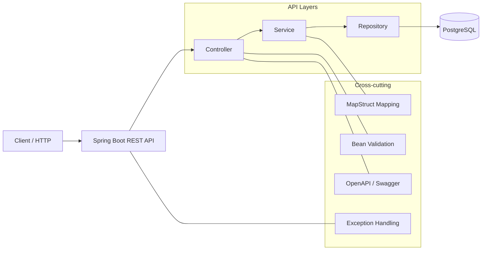

# java-spring-rest-api-template

Production-ready Java Spring Boot REST API boilerplate. Applying SOLID principles learned from Go/Rust ecosystems to enterprise Java.

---

[](https://adoptium.net/)
[](https://spring.io/projects/spring-boot)


---

## 🧱 Arquitetura (Visão Geral)



## 📁 Estrutura de Pastas

```text
src/
├── main/
│   ├── java/com/api/boilerplate/
│   │   ├── config/          # OpenAPI, BCrypt bean, etc.
│   │   ├── controller/      # UserController (REST endpoints)
│   │   ├── dto/             # Records: requests/responses, ErrorResponse
│   │   ├── entity/          # JPA entities (User)
│   │   ├── exception/       # Custom exceptions + GlobalExceptionHandler
│   │   ├── mapper/          # MapStruct mappers (UserMapper)
│   │   ├── repository/      # Spring Data repositories
│   │   ├── service/         # Service interfaces
│   │   │   └── impl/        # Service implementations (UserServiceImpl)
│   │   └── Application.java # @SpringBootApplication (entrypoint)
│   └── resources/
│       ├── application.yml       # Base config
│       ├── application-dev.yml   # Dev profile
│       └── application-prod.yml  # Prod profile
└── test/
    └── java/com/api/boilerplate/service/
        └── UserServiceImplTest.java
```

## 🚀 Tecnologias

- Java 17
- Spring Boot 3.x (Web, Validation, Data JPA)
- PostgreSQL
- H2 (testes)
- MapStruct
- SpringDoc OpenAPI (Swagger UI)
- JUnit 5 + Mockito
- Maven
- Docker & Docker Compose

## 🔧 Como Rodar (Docker Compose)

```bash
git clone https://github.com/ElioNeto/java-spring-rest-api-template.git
cd java-spring-rest-api-template

# Build da aplicação (gera o JAR em target/)
mvn clean package -DskipTests

# Sobe PostgreSQL + aplicação em containers
docker-compose up --build
```

- API: http://localhost:8080
- Swagger UI: http://localhost:8080/swagger-ui.html
- OpenAPI JSON: http://localhost:8080/v3/api-docs

## 📡 Endpoints Principais

| Método | Endpoint          | Descrição             |
|--------|-------------------|------------------------|
| POST   | `/api/users`      | Criar usuário          |
| GET    | `/api/users/{id}` | Buscar usuário por ID  |
| GET    | `/api/users`      | Listar todos usuários  |
| PUT    | `/api/users/{id}` | Atualizar usuário      |
| DELETE | `/api/users/{id}` | Remover usuário        |

## 🧪 Executando Localmente (sem Docker)

Pré-requisitos: Java 17, Maven, PostgreSQL rodando em `localhost:5432` com DB `boilerplate_db`.

```bash
# Configurar banco local
createdb boilerplate_db

# Rodar com profile dev
mvn spring-boot:run -Dspring-boot.run.profiles=dev
```

## 🧪 Testes

```bash
mvn test
```

Os testes de exemplo cobrem a lógica de `UserServiceImpl` usando Mockito.

## 🎯 Princípios de Design

- **SOLID** aplicado em controllers, services e repositories
- Serviços expostos via **interfaces** (`UserService`) para facilitar troca/Mock
- **DTOs (records)** para contratos de API (sem expor entidades JPA)
- **MapStruct** para mapeamento declarativo e seguro em tempo de compilação
- **@ControllerAdvice** para tratamento de exceções consistente
- **Bean Validation** em todos os payloads de entrada

## 📦 Produção

- Configuração externa via `application-prod.yml` + variáveis de ambiente
- Pool de conexões Hikari configurado para PostgreSQL
- Imagem Docker minimalista com Temurin JRE 17
- Pronto para integrar Spring Security (JWT/OAuth2) sem mudanças estruturais

